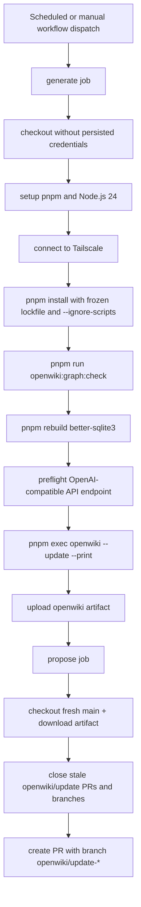

# OpenWiki Update Workflow

## Runtime flow

Runtime flow caption: Aurora’s OpenWiki update runs in two jobs, one to generate docs in a model-only environment and one to propose a PR from the generated artifact.

## Workflow behavior from [`.github/workflows/openwiki-update.yml`](../.github/workflows/openwiki-update.yml)

The workflow is triggered by both `workflow_dispatch` and a daily cron (`0 8 * * *`).

### `generate` job

- Runs on `ubuntu-latest` with repository read permissions.
- Checks out source with `persist-credentials: false`.
- Installs pnpm `10.33.2`, Node.js `24`, and connects via Tailscale.
- Installs dependencies with `pnpm install --frozen-lockfile --ignore-scripts`.
- Runs `pnpm run openwiki:graph:check`.
- Rebuilds `better-sqlite3` to satisfy OpenWiki's native dependency (`better-sqlite3` bindings).
- Preflights the model endpoint at `OPENAI_COMPATIBLE_BASE_URL` using `OPENAI_COMPATIBLE_API_KEY`.
- Executes OpenWiki with:
  - `OPENWIKI_PROVIDER=openai-compatible`
  - `OPENWIKI_MODEL_ID=gpt-5.3-codex-spark`
  - `pnpm exec openwiki --update --print`
- Uploads only the `openwiki/` directory as the generated artifact.

### `propose` job

- Runs after successful generation.
- Checks out fresh `main`, downloads the generated artifact, and supersedes older openwiki branches/PRs.
- Uses pinned `peter-evans/create-pull-request` action `22a9089034f40e5a961c8808d113e2c98fb63676`.
- Creates PRs with:
  - `branch: openwiki/update`
  - `branch-suffix: timestamp`
  - `add-paths: openwiki`
  - commit message/title `docs: update OpenWiki`

## Why this matters for future updates

This workflow now documents the exact, current automation boundaries. When source changes affect OpenWiki-facing files such as [`CLAUDE.md`](../CLAUDE.md#openwiki) or the workflow itself, only the corresponding OpenWiki pages should be edited to stay surgical.